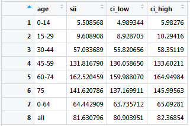

The `SocEpi` package is developed for research in social epidemiology, particularly for health inequality research. The user guide will show you how to install the package, give some examples of how to work with it and reference the methods used for some of the calculations. This is the first public version of the package and there are likely to be some bugs. If you notice any problems or think that the functions are not performing correctly, please use the package repository's *Issues* section on GitHub <https://github.com/m-allik/SocEpi>. Comments and suggestions are welcome!


##Installation

Before installing `ScoEpi`, install the dependencies and then load them using the following code. This may take some time if you have not used any of these packages before.

```{r, eval=F}
install.packages(c("dplyr", "tidyr"), dependencies = TRUE)
library(dplyr)
library(tidyr)
```

You can then install the `SocEpi` package from GitHub using the devtools package. If the installation is successful you may see the note `package 'SocEpi' successfully unpacked and MD5 sums checked`. The library can be then loaded using `library(SocEpi)`.

```{r eval=F}
install.packages(devtools) # if not installed before
devtools::install_github("m-allik/SocEpi")
library(SocEpi)
```


```{r echo=FALSE}
library(SocEpi)
```

##Examples

When the package is loaded test to see if you can run some of the examples from the help documentation. The package includes the following functions: `w_pcntile`, `zscore`, `rii`, `smr` and `st_rate`. You can look each of these up using `?`*function_name*. For example, use `?w_pcntile` or `?rii` to look up the weighted percentile and the SII/RII functions. The package also includes test data (*dep_data* and *dep_data_long*), you can look up the code books for these by typing `?dep_data` and `?dep_data_long`. Use `summmary(dep_data_long)` or `str(dep_data_long)` to look at the data. Follow the examples given in the help documentation to see how the functions work. If the code in the help files gives you the same results as below then the package is loaded successfully and you can test it on your own data.

```{r}
#Example of creating deciles using wide format data
data <- dep_data

#calculate deciles (default)
data$dec_overcrowd <- w_pcntile(data, total_pop, pcnt_overcrowding)

#average percent of overcrowding by decile
tapply(data$pcnt_overcrowding, data$dec_overcrowd, mean)
```

It may take a few seconds to run the `rii` function, the simulation is a bit lengthy and I recommend not going above 1000 if you are just doing some preliminary analysis. A number of built-in standard population weights are provided for standardization, to view these type `?st_pop`. If you can summarize the data and use the `w_pcntile` and `zscore` function, but get an error running the `rii` or `st_rate` functions, then the dependencies `dplyr` or `tidyr` might not be loaded properly into R.

```{r}
#Example of calculating RII/SII with long format data
d <- dep_data_long

#RII with 95% CI
rii(d, bad, pop, quintile, age, ethnicity == "all")

#SII with 99% CI
rii(d, bad, pop, quintile, age, ethnicity == "all", RII=FALSE, CI=99)

#supply own population weights
new_w <- c(0.075, 0.075, 0.075, 0.06, 0.060, 0.060, 0.06, 0.070, 0.050, 
           0.050, 0.050, 0.06, 0.060, 0.055, 0.050, 0.040, 0.025, 0.025)

rii(d, bad, pop, quintile, age, ethnicity == "all", RII=FALSE, CI=99, st_pop=new_w)

#SII for new age groups with 95% CI
rii(d, bad, pop, quintile, age, ethnicity == "Scot" &  ur2fold == "Urban",
   age_group=c("0-19", "20-34", "35-49"), RII=FALSE)

```

The printed results in R console will be rounded, but you can view more digits by saving the results in an object as shown in the example below. A small table like that in Figure 1 will open above your console.

```{r eval=FALSE}
#SII with 99% CI
rii_results <- rii(d, bad, pop, quintile, age, ethnicity == "all", RII=FALSE, CI=99)
View(rii_results)
```





##Separate age groups for ages 0 and 1-4

The `rii` and `st_rate` functions will automatically assume that the data include separate age groups for ages 0 and 1-4 if the first (under one) age group is coded 0. Built in standard population options for these groups are also included. **If your data do not include a separate age group for those under 1, do not start numbering your age groups from 0.**


##Combined age groups

Sometimes age groups may be combined due to disclosure reasons, for example, groups, 0-4, 5-9 and 10-14 may be under a single group 0-14. In such cases the data need to be padded and user supplied weights need to be given to work with the `rii` and `st_rate` functions. Using the above example, add two new age groups for 0-4 and 5-9 (coding these as age groups 1 and 2) for all possible combinations in the dataset (such as for all deprivation levels, gender, ethnicity or other characteristics). The health and population values for these new age groups should be set to zero. The age group 0-14 will now represent the age group 10-14 and should be coded 3. The coding for other age groups should also change accordingly. An example of padded data is given in Table \ref{T1}, where health and population data is provided for three deprivation levels (variable *ses*) and for both sexes.

\begin{table}[ht]
\centering
\caption{Example of padded data}
\label{T1}
\scalebox{0.8}{
\begin{tabular}{rlrrrrrllrrrrr}
  \hline
  \multicolumn{6}{c}{Original data} &&  \multicolumn{6}{c}{Padded data} \\
  \cline{1-6} \cline{8-13}
 age & code & health & pop & ses & sex &  & age & code & health & pop & ses & sex \\ 
  \hline
0-14 & 1 & 2 & 110 & 1 & 1 &  & 0-4 & 1 & 0 & 0 & 1 & 1 \\ 
0-14 & 1 & 1 & 100 & 2 & 1 &  & 0-4 & 1 & 0 & 0 & 2 & 1 \\ 
0-14 & 1 & 5 & 102 & 3 & 1 &  & ... &  &  &  &  &  \\ 
0-14 & 1 & 2 & 100 & 1 & 0 &  & 0-4 & 1 & 0 & 0 & 3 & 0 \\ 
0-14 & 1 & 3 & 120 & 2 & 0 &  & 5-9 & 2 & 0 & 0 & 1 & 1 \\ 
0-14 & 1 & 6 & 108 & 3 & 0 &  & 5-9 & 2 & 0 & 0 & 2 & 1 \\ 
15-19 & 2 & 2 & 30 & 1 & 1 &  & ... &  &  &  &  &  \\ 
15-19 & 2 & 3 & 33 & 2 & 1 &  & 5-9 & 2 & 0 & 0 & 3 & 0 \\ 
... &  &  &  &  &  &  & 10-14/0-14 & 3 & 2 & 110 & 1 & 1 \\ 
&  &  &  &  &  &  & 10-14/0-14 & 3 & 1 & 100 & 2 & 1 \\ 
&  &  &  &  &  &  & ... &  &  &  &  &  \\ 
&  &  &  &  &  &  & 10-14/0-14 & 3 & 6 & 108 & 3 & 0 \\ 
&  &  &  &  &  &  & 15-19 & 4 & 2 & 30 & 1 & 1 \\ 
&  &  &  &  &  &  & 15-19 & 4 & 3 & 33 & 2 & 1 \\ 
&  &  &  &  &  &  & ... &  &  & &  &  \\ 
   \hline
\end{tabular}}
\end{table}

Next, create population weights, such that the new age groups 0-4 and 5-9 have zero weight and the combined age group 10-14 (representing ages 0-14) will have the combined weight of all three age groups. For example, the 2013 ESP weights are 0.05, 0.055 and 0.055 respectively for ages 0-4, 5-9 and 10-14. These should in this example become 0, 0 and 0.16 (0.05 + 0.055 + 0.055) respectively. Supply these new weights to the function.

Note, when choosing age groups for which to display the results from `rii` or `st_rate`, you need to take account of how your original data was grouped. In this example it does not make sense to request output for any age group that splits the ages 0-14 into separate groups. Results for age groups 5-14 or 10-19 would automatically include those aged younger than 5 or 10 and thus would not be correct.


##Open-ended age groups

The last age group should generally be open-ended. The buit-in weights include options for the open-ended age groups 85+ and 95+ for 2013 ESP and 85+ for 1976 ESP. If your data includes another open-ended age group, such as 75+ or 90+ use user supplied weights that capture this. Other amendments should not be necessary.


##Methods

The SII obtained via OLS regression of the health variable ($y$) on the midpoints of the cumulative population distribution ($X$) such that $SII=(X'X)^{-1} X'y)$. When SII is estimated via weighted least squares the weights will be equal to the population share of each age group and $SII=(X'WX)^{-1} X'Wy)$.

The confidence intervals for the directly standardized rates are calculated as $CI_r = r \pm z \frac{r}{\sqrt{n}}$, where $r$ is the standardized rate, $z$ the z-score for a chosen confidence level (e.g. 1.96 for 95% CI) and $n$ the total number of health events in the age group/population.

The confidence intervals for the SMR are calculated as $CI_{SMR} = SMR \pm z\frac{\sqrt{O}}{E}$, where $z$ the z-score for chosen confidence level (e.g. 1.96 for 95% CI), $O$ is the observed number of health events in the age group/population and E is the expected number of health events in the age group/population.

