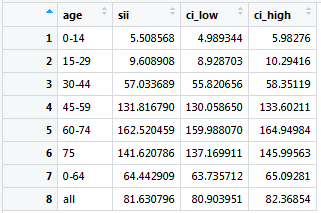

```{r, include = FALSE}
knitr::opts_chunk$set(
  collapse = TRUE,
  comment = "#>"
)
```

```{r setup}
library(SocEpi)
```


The `SocEpi` package is developed for research in social epidemiology, particularly for health inequality research. The user guide will give some examples of the main functions and references the methods used for the calculations. If you notice any problems or think that the functions are not performing correctly, please use the package repository's *Issues* section on GitHub <https://github.com/m-allik/SocEpi>. Comments and suggestions are welcome!


# Installation

Before installing `ScoEpi`, install the dependencies and then load them using the following code. This may take some time if you have not used any of these packages before. You can skip this step if you have `dplyr` and `tidyr` (or `tidyverse`) installed.

```{r, eval=F}
install.packages(c("dplyr", "tidyr", "Rcpp"), dependencies = TRUE)
library(dplyr)
library(tidyr)
library(Rcpp)
```

You can then install the `SocEpi` package.

```{r eval=F}
install.packages(SocEpi) # if not installed before
library(SocEpi)
```


# Examples

When the package is loaded test to see if you can run some of the examples from the help documentation. The package includes the following functions: `zscore`, `w_pcntile`, `smr`, `st_rate` and `rii`. You can look each of these up using `?`*function_name*. For example, use `?w_pcntile` or `?rii` to look up the weighted percentile and the SII/RII functions. The package also includes test data (*dep_data* and *health_data*), you can look up the code books for these by typing `?dep_data` and `?health_data`. Use `summmary(health_data)` or `str(health_data)` to look at the data. Follow the examples given in the help documentation to see how the functions work. If the code in the help files gives you the same results as below then the package is loaded successfully and you can test it on your own data.


## Functions for measruing deprivation

The functions `zscore` and `w_pcntile` are useful for developing deprivation measures. `zscore` calculates z-scores (standardized scores) for a deprivation indicator (e.g. percent unemployed) with a mean close to zero and standard deviation (sd) close to one.

```{r}
data <- dep_data

# Calculate z-score, weighted mean, sd and store all data in object z_oc
z_oc <- zscore(data$total_pop, data$pcnt_overcrowding)

# Extract z-score
data$z_overcrowd <- z_oc$z.score
mean(data$z_overcrowd) #mean of z-score
sd(data$z_overcrowd) #sd z-score

# Compare weighted mean and sd to actual mean and sd
mean(data$pcnt_overcrowding)
z_oc$w.mean
sd(data$pcnt_overcrowding)
z_oc$w.sd
```


The `w_pcntile` calculates population weighted deprivation percentiles, such as deciles or quintiles. The function is useful for calculation categorical deprivation measures that can be used to measure inequalities in health.


```{r}
# Calculate deciles (default)
data$dec_overcrowd <- w_pcntile(data, total_pop, pcnt_overcrowding)

# Percent of people by decile - note minor variation
tapply(data$total_pop, data$dec_overcrowd, sum)/sum(data$total_pop)*100

# Average percent of overcrowding by decile
tapply(data$pcnt_overcrowding, data$dec_overcrowd, mean)
```


## Functions for measruing health inequalities


The three functions `smr`, `st_rate` and `rii` are useful for measuring health and health inequalities. The `smr` function calculates standardized mortality ratios (SMR) and confidence intervals using indirect standardization. The function requires that at least two population groups be provided by the `sets` argument. The first of these populations will be used as the standard or the reference population and the SMRs will be calculated for the second population. If more than two groups are identified the first population will still be the reference population and the SMRs will be calculated for all other groups. The `smr`, `st_rate` and `rii` all allow the used to select age groups for which the results are provided, results for ages 0-64 and all ages are always provided.

```{r}
# Example of calculating RII/SII with long format data
d <- health_data

# Asian population compared to Scottish (reference)
smr(d, bad, pop, age, ethnicity, sets = c("Scot", "asian"))

# Asian, White British and Irish population compared to Scottish (reference)
smr(d, bad, pop, age, ethnicity, sets = c("Scot", "asian", "WB", "Irish"),
   age_group = c("15-29", "30-44"), CI = 99)
```


The `st_rate` function calculates direct standardized rates by deprivation or socioeconomic status (SES). Overall rates across all deprivation categories or SES are also provided. The function provides multiple built-in standard populations, but user supplied weights can also be provided. Sub-populations (gender, ethnicity) can be selected using the `groups` argument.


```{r}
# Standardized rates for all people
st_rate(d, bad, pop, quintile, age, ethnicity == "all")

# Standardized rates for Scottish for ages 15-29 and 30-44 with 99% CI
st_rate(d, bad, pop, quintile, age, ethnicity == "Scot", 
        age_group=c("15-29", "30-44"), CI=99)
```


The `rii` function calculates either the slope (SII) or the relative (RII) index of inequality. It may take a few seconds to run the `rii` function, the simulation is a bit lengthy and I recommend not going above 1000 if you are just doing some preliminary analysis. A number of built-in standard population weights are provided for standardization, to view these type `?st_pop`. **Note!** If you can summarize the data and use the `w_pcntile` and `zscore` function, but get an error running the `rii` or `st_rate` functions, then the dependencies `dplyr` or `tidyr` might not be loaded properly into R.


```{r}
# RII with 95% CI
rii(d, bad, pop, quintile, age, ethnicity == "all")

# SII with 99% CI
rii(d, bad, pop, quintile, age, ethnicity == "all", RII=FALSE, CI=99)

# supply own population weights
new_w <- c(0.075, 0.075, 0.075, 0.06, 0.060, 0.060, 0.06, 0.070, 0.050, 
           0.050, 0.050, 0.06, 0.060, 0.055, 0.050, 0.040, 0.025, 0.025)

rii(d, bad, pop, quintile, age, ethnicity == "all", RII=FALSE, CI=99, st_pop=new_w)

# SII for new age groups with 95% CI
rii(d, bad, pop, quintile, age, ethnicity == "Scot" &  ur2fold == "Urban",
   age_group=c("0-19", "20-34", "35-49"), RII=FALSE)

```

The printed results in R console will be rounded, but you can view more digits by saving the results in an object as shown in the example below. A small table like that in Figure 1 will open above your console.

```{r eval=FALSE}
# SII with 99% CI
rii_results <- rii(d, bad, pop, quintile, age, ethnicity == "all", RII=FALSE, CI=99)
View(rii_results)
```





## Separate age groups for ages 0 and 1-4

The `rii` and `st_rate` functions will automatically assume that the data include separate age groups for ages 0 and 1-4 if the first (under one) age group is coded 0. Built in standard population options for these groups are also included. **If your data do not include a separate age group for those under 1, do not start numbering your age groups from 0.**


## Combined age groups

Sometimes age groups may be combined due to disclosure reasons, for example, groups, 0-4, 5-9 and 10-14 may be under a single group 0-14. In such cases the data need to be padded and user supplied weights need to be given to work with the `rii` and `st_rate` functions. Using the above example, add two new age groups for 0-4 and 5-9 (coding these as age groups 1 and 2) for all possible combinations in the data set (such as for all deprivation levels, gender, ethnicity or other characteristics). The health and population values for these new age groups should be set to zero. The age group 0-14 will now represent the age group 10-14 and should be coded 3. The coding for other age groups should also change accordingly. An example of padded data is given in Table \ref{T1}, where health and population data is provided for three deprivation levels (variable *ses*) and for both sexes.

\begin{table}[ht]
\centering
\caption{Example of padded data}
\label{T1}
\scalebox{0.8}{
\begin{tabular}{rlrrrrrllrrrrr}
  \hline
  \multicolumn{6}{c}{Original data} &&  \multicolumn{6}{c}{Padded data} \\
  \cline{1-6} \cline{8-13}
 age & code & health & pop & ses & sex &  & age & code & health & pop & ses & sex \\ 
  \hline
0-14 & 1 & 2 & 110 & 1 & 1 &  & 0-4 & 1 & 0 & 0 & 1 & 1 \\ 
0-14 & 1 & 1 & 100 & 2 & 1 &  & 0-4 & 1 & 0 & 0 & 2 & 1 \\ 
0-14 & 1 & 5 & 102 & 3 & 1 &  & ... &  &  &  &  &  \\ 
0-14 & 1 & 2 & 100 & 1 & 0 &  & 0-4 & 1 & 0 & 0 & 3 & 0 \\ 
0-14 & 1 & 3 & 120 & 2 & 0 &  & 5-9 & 2 & 0 & 0 & 1 & 1 \\ 
0-14 & 1 & 6 & 108 & 3 & 0 &  & 5-9 & 2 & 0 & 0 & 2 & 1 \\ 
15-19 & 2 & 2 & 30 & 1 & 1 &  & ... &  &  &  &  &  \\ 
15-19 & 2 & 3 & 33 & 2 & 1 &  & 5-9 & 2 & 0 & 0 & 3 & 0 \\ 
... &  &  &  &  &  &  & 10-14/0-14 & 3 & 2 & 110 & 1 & 1 \\ 
&  &  &  &  &  &  & 10-14/0-14 & 3 & 1 & 100 & 2 & 1 \\ 
&  &  &  &  &  &  & ... &  &  &  &  &  \\ 
&  &  &  &  &  &  & 10-14/0-14 & 3 & 6 & 108 & 3 & 0 \\ 
&  &  &  &  &  &  & 15-19 & 4 & 2 & 30 & 1 & 1 \\ 
&  &  &  &  &  &  & 15-19 & 4 & 3 & 33 & 2 & 1 \\ 
&  &  &  &  &  &  & ... &  &  & &  &  \\ 
   \hline
\end{tabular}}
\end{table}

Next, create population weights, such that the new age groups 0-4 and 5-9 have zero weight and the combined age group 10-14 (representing ages 0-14) will have the combined weight of all three age groups. For example, the 2013 ESP weights are 0.05, 0.055 and 0.055 respectively for ages 0-4, 5-9 and 10-14. These should in this example become 0, 0 and 0.16 (0.05 + 0.055 + 0.055) respectively. Supply these new weights to the function.

Note, when choosing age groups for which to display the results from `rii` or `st_rate`, you need to take account of how your original data was grouped. In this example it does not make sense to request output for any age group that splits the ages 0-14 into separate groups. Results for age groups 5-14 or 10-19 would automatically include those aged younger than 5 or 10 and thus would not be correct.


## Open-ended age groups

The last age group should generally be open-ended. The built-in weights include options for the open-ended age groups 85+ and 95+ for 2013 ESP and 85+ for 1976 ESP. If your data includes another open-ended age group, such as 75+ or 90+ use user supplied weights that capture this. Other amendments should not be necessary.


## Individual level data

The functions can be used for individual level data just as they are used for aggregate data. The functions will aggregate the individual level data up by socioeconomic status and calculate the rates, RII/SII on these.


# Methods

## Z-scores and percentiles

The z-score is calculated using the population weighted mean $\mu_w$ and standard deviation $sd_w$. The population weighted mean $\mu_w=\sum_{i=1}^{n} d_i w_i$, where $d_i$ is the deprivation variable for a small area (such as percent of unemployment) and $w_i$ the population weight, i.e. the percent of people in a small area from total population. The population weighted standard deviation is calculated as $sd_w = \sqrt{\sum_{i=1}^{n} (d_i - \mu_w)^2 w_i}$. The z-score for the deprivation variable for each small area then is $z_i = (d_i - \mu_w)/sd_w$.

The percentiles are calculated by ordering the small areas by deprivation and then placing the small areas into groups of equal population size. For example, to calculate deciles the total population across all small areas is divided by 10, which gives the population size for a decile. The small areas are then ordered and distributed into 10 groups that have a population size roughly equal to the population size just calculated. It is generally not possible to ensure that the percentiles have exactly equal population sizes (see example above), particularly when the average population of the small area is large relative to the total population.

If multiple percentiles are calculated for a research project it may make sense to calculate the percentiles with the highest number of groups first and then sum these into other percentiles. In other words, calculate deciles first and then group the deciles into quintiles. This will ensure that areas that belong to the same deciles will also belong to the same quintile. Using `w_pcntile` for quintiles and deciles separately may mean that some areas that belong to the same decile end up in a different quintile.


## Standardised mortality ratio


The standardized mortality ratio (SMR) is the number of deaths (or other health events) observed in the study population $h_o$ divided by the number that would be expected if the age-specific rates of a standard (reference) population had applied $h_e$. This rate is often multiplied by a hundred; $SMR = \frac{h_o}{h_e} 100$. The expected number of health events is defined as $h_e = \sum_{i=1}^{n} n_ir_i$, where $n_i$ is the number of people in an age group in the study population, $r_i$ the crude rate for an age group in the standard (reference) population and $n$ the number of age groups.

The confidence intervals for the SMR are calculated as $CI_{SMR} = SMR \pm z\frac{\sqrt{h_o}}{h_e}$, where $z$ the z-score for chosen confidence level (e.g. 1.96 for 95% CI).

## Directly standardized rates

The confidence intervals for the directly standardized rates are calculated as $CI_r = r \pm z \frac{r}{\sqrt{h}}$, where $r$ is the standardized rate, $z$ the z-score for a chosen confidence level (e.g. 1.96 for 95% CI) and $h$ the total number of health events.

## SII and RII

The SII (and RII) are calculated on direct standardized rates. The SII is obtained via an OLS regression of the standardized health variable ($y$) on the midpoints of the cumulative population distribution ($X$); $SII = (X'X)^{-1} X'y$. The cumulative population distribution is calculated separately for each age groups. For example, for quintiles the midpoints for age groups are not exactly 0.1, 0.2, 0.5, 0.7 and 0.9. This will have an impact on SII/RII when some sub-populations, such as some age or ethnic groups, are disproportionately more likely to live in deprived or least deprived areas. It will have minimal impact on RII/SII for large age groups such as 0-64 and when the `groups` argument is not used.

When SII is estimated via weighted least squares the weights will be equal to the population share of each age group; $SII = (X'WX)^{-1} X'Wy)$. The relative index of inequality is calculated as $RII = SII/\mu$, where $\mu$ is the mean level of health across all socioeconomic statuses.

The confidence intervals for SII/RII are calculated using a simulation methods described by Lumme et al (2015) "A Monte Carlo method to estimate the confidence intervals for the concentration index using aggregated population register data." Health Services & Outcomes Research Methodology, 15(2), 82-98. \url{http://doi.org/10.1007/s10742-015-0137-1}.


## Decomposing RII

Researchers are often interested in the contribution a specific cause of death or illness on inequalities in health. To decompose RII calculate the SII for the different causes and divide these by the mean level of health for all causes. That is $RII_c = SII_c/\mu$, where $RII_c$ is the decomposed RII for a specific cause or illness, $SII_c$ is the SII for a specific cause or illness and $\mu$ the mean level of health across all causes and socioeconomic statuses.

